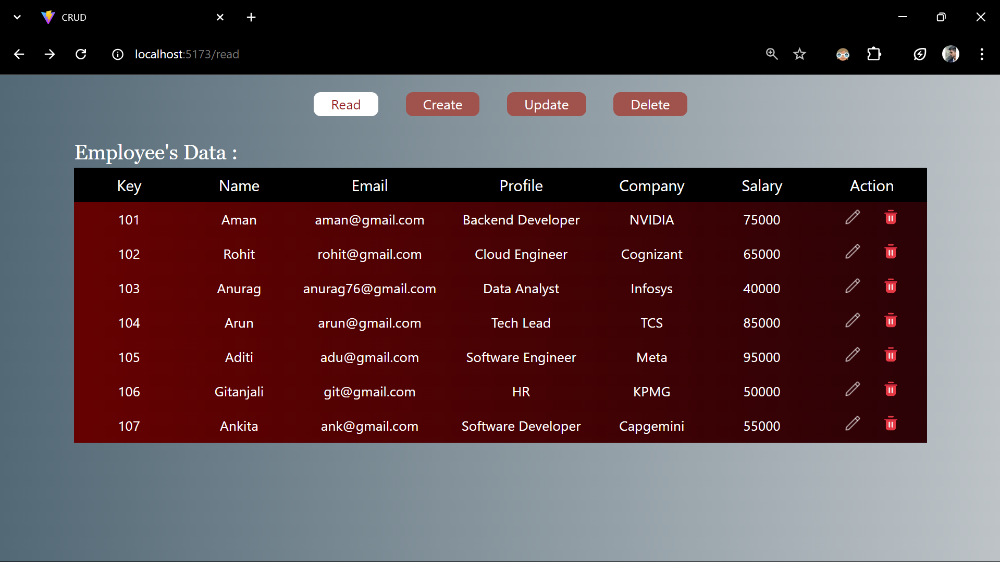

# CRUD Application

## Project Description: 
This project is a full-stack CRUD (Create, Read, Update, Delete) application which allows users to perform CRUD operations on a set of data, offering a seamless user experience.




### `Features`:
1. A specialized CRUD application with dedicated Update and Delete sections, allowing users to enter a specifc key
to retrieve information and perform further actions, such as editing or deleting records.
2. This approach streamlines the update process, making data management more efcient.
3. The intuitive user interface enhances the browsing experience and simplifies data management.
4. Users can effortlessly create new entries, view all stored data, update existing records, and delete unnecessary
entries to maintain relevance and organization.


### `Technologies used`: 
React.js, JavaScript, Node.js, Express.js, MongoDB, Tailwind CSS


### `Installation Steps` :
Follow these steps to set up and run the project locally -

1. **Clone the repository :**
   Clone the repository to your local machine by running the following command in your terminal:
   ```sh
   git clone https://github.com/your-username/your-project.git
2. **Navigate to the project directory**
3. **Install any neccessary dependencies**
4. **Set up MongoDB :**
   Ensure MongoDB is running on your local machine.
5. **Run the backend server :**
   ```sh
   npm start
  The backend server will run on http://localhost:8000.

6. **Run the frontend server :**
   ```sh
   cd your-frontend-repo
   npm install
   npm run dev

 Enjoy managing your data with this full-stack solution!
