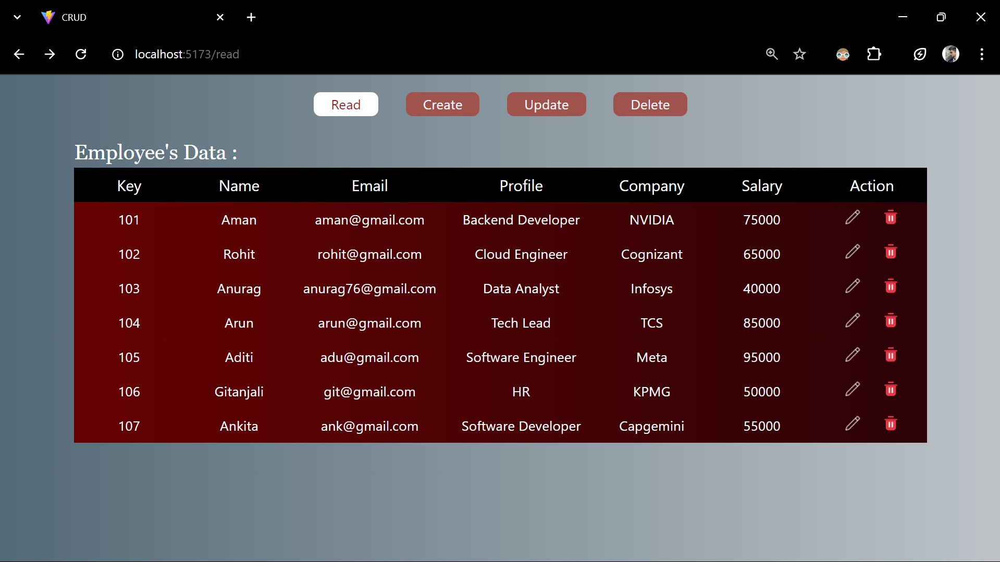

# CRUD Application

## Project Description: 
This project is a full-stack CRUD (Create, Read, Update, Delete) application which allows users to perform CRUD operations on a set of data, offering a seamless user experience.


[CRUD](https://amancantgit.github.io/)


### `Features`:
1. Create Data: Users can easily add new entries to the application, ensuring the data is stored and organized.
2. Read Data: Users can view all stored entries in a clean and intuitive user interface that enhances the browsing experience.
3. Update Data: Users can update existing entries, allowing them to keep the information current and accurate.
4. Delete Data: Users can remove entries that are no longer needed, keeping the data set relevant and up-to-date.
5. Update Section: Users can enter the key of a specific entry to quickly retrieve and edit the corresponding information, streamlining the update process.
6. Delete Section: Users can enter the key of a specific entry to quickly retrieve and delete the corresponding information, making data management more efficient.


### `Technologies used`: 
React.js, HTML, Tailwind CSS, JavaScript, Node.js, Express.js, MongoDB


### Installation Steps :
Follow these steps to set up and run the project locally -

1. **Clone the repository :**
   Clone the repository to your local machine by running the following command in your terminal:
   ```sh
   git clone https://github.com/your-username/your-project.git
2. **Navigate to the project directory**
3. **Install any neccessary dependencies**
4. **Set up MongoDB :**
   Ensure MongoDB is running on your local machine.
5. **Run the backend server :**
   ```sh
   npm start
  The backend server will run on http://localhost:8000.

6. **Run the frontend server :**
   ```sh
   cd your-frontend-repo
   npm install
   npm run dev

 Enjoy managing your data with this full-stack solution!
